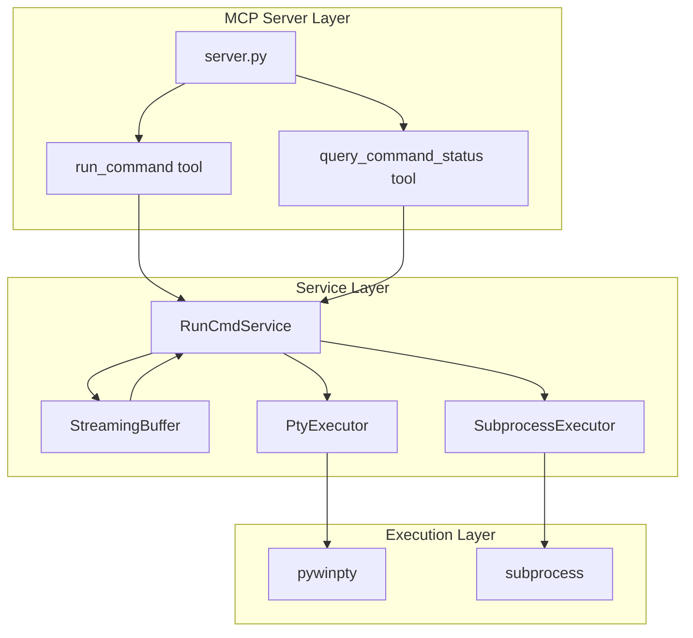
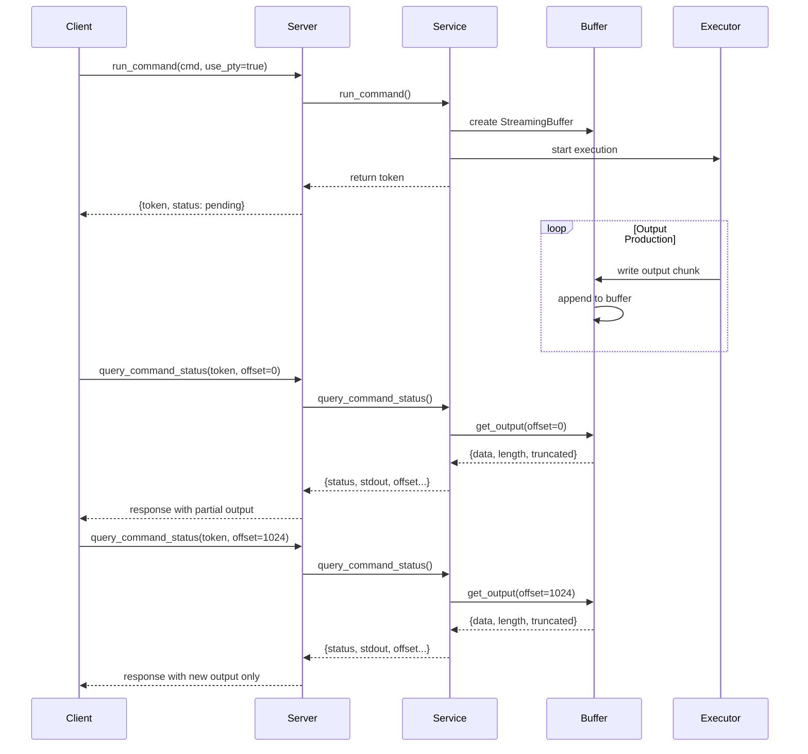

# Design Document: runcmd-mcp 实时输出流功能

## Overview

本设计文档描述了 runcmd-mcp 项目的实时输出流功能实现方案。该功能通过引入 PTY（伪终端）支持和流式输出缓冲机制，使用户能够在长时间运行的命令执行过程中实时查看输出，而不必等待命令完全结束。

### 核心目标

1. 支持命令执行过程中的实时输出捕获
2. 提供增量查询接口，支持只获取新增输出
3. 通过 PTY 模式解决进度条等终端交互程序的输出问题
4. 保持与现有 API 的向后兼容性

## Architecture

### 系统架构图



### 执行流程



## Components and Interfaces

### 1. StreamingBuffer 类

流式输出缓冲区，负责管理命令执行过程中的输出数据。

```python
class StreamingBuffer:
    """线程安全的流式输出缓冲区"""
    
    def __init__(self, max_size: int = 10 * 1024 * 1024):
        """
        初始化缓冲区
        
        Args:
            max_size: 最大缓冲区大小（字节），默认 10MB
        """
        self._buffer: bytearray = bytearray()
        self._lock: threading.Lock = threading.Lock()
        self._max_size: int = max_size
        self._truncated: bool = False
        self._truncated_bytes: int = 0
    
    def write(self, data: bytes) -> None:
        """
        写入数据到缓冲区
        
        Args:
            data: 要写入的字节数据
        """
        pass
    
    def get_output(self, offset: int = 0) -> dict:
        """
        获取从指定偏移量开始的输出
        
        Args:
            offset: 起始偏移量
            
        Returns:
            {
                "data": str,           # 输出内容
                "length": int,         # 当前总长度
                "truncated": bool,     # 是否发生过截断
                "truncated_bytes": int # 被截断的字节数
            }
        """
        pass
    
    def get_all(self) -> str:
        """获取全部输出内容"""
        pass
    
    @property
    def length(self) -> int:
        """当前缓冲区长度"""
        pass
```

### 2. PtyExecutor 类

PTY 模式命令执行器，使用 pywinpty 在伪终端环境中执行命令。

```python
class PtyExecutor:
    """PTY 模式命令执行器"""
    
    def __init__(self, buffer: StreamingBuffer):
        """
        初始化执行器
        
        Args:
            buffer: 输出缓冲区
        """
        self._buffer = buffer
        self._process = None
        self._reader_thread = None
    
    def execute(
        self,
        command: str,
        working_directory: Optional[str] = None,
        env: Optional[dict] = None,
        timeout: Optional[int] = None
    ) -> dict:
        """
        在 PTY 中执行命令
        
        Args:
            command: 要执行的命令
            working_directory: 工作目录
            env: 环境变量
            timeout: 超时时间（秒）
            
        Returns:
            {
                "exit_code": int,
                "timeout_occurred": bool
            }
        """
        pass
    
    def _read_output(self) -> None:
        """后台线程：持续读取 PTY 输出"""
        pass
    
    def terminate(self) -> None:
        """终止执行"""
        pass
```

### 3. SubprocessExecutor 类

标准 subprocess 模式执行器，支持流式输出捕获。

```python
class SubprocessExecutor:
    """标准 subprocess 模式执行器（带流式输出）"""
    
    def __init__(self, buffer: StreamingBuffer):
        """
        初始化执行器
        
        Args:
            buffer: 输出缓冲区
        """
        self._buffer = buffer
        self._process = None
        self._reader_thread = None
    
    def execute(
        self,
        command: str,
        working_directory: Optional[str] = None,
        env: Optional[dict] = None,
        timeout: Optional[int] = None
    ) -> dict:
        """
        使用 subprocess 执行命令（流式捕获输出）
        
        Args:
            command: 要执行的命令
            working_directory: 工作目录
            env: 环境变量
            timeout: 超时时间（秒）
            
        Returns:
            {
                "exit_code": int,
                "timeout_occurred": bool
            }
        """
        pass
    
    def _read_output(self, pipe, is_stderr: bool = False) -> None:
        """后台线程：持续读取管道输出"""
        pass
```

### 4. RunCmdService 扩展

扩展现有服务类以支持新功能。

```python
class RunCmdService:
    """异步命令执行服务类（扩展版）"""
    
    def run_command(
        self,
        command: str,
        timeout: int = 30,
        working_directory: Optional[str] = None,
        use_pty: bool = False,           # 新增：是否使用 PTY 模式
        max_buffer_size: int = 10485760  # 新增：最大缓冲区大小
    ) -> str:
        """
        异步运行命令
        
        Args:
            command: 要执行的命令
            timeout: 超时时间（秒）
            working_directory: 工作目录
            use_pty: 是否使用 PTY 模式（默认 False）
            max_buffer_size: 最大输出缓冲区大小（默认 10MB）
            
        Returns:
            命令执行的 token
        """
        pass
    
    def query_command_status(
        self,
        token: str,
        stdout_offset: int = 0,   # 新增：stdout 偏移量
        stderr_offset: int = 0    # 新增：stderr 偏移量
    ) -> dict:
        """
        查询命令执行状态
        
        Args:
            token: 命令的 token
            stdout_offset: stdout 输出偏移量（默认 0，返回全部）
            stderr_offset: stderr 输出偏移量（默认 0，返回全部）
            
        Returns:
            {
                "token": str,
                "status": str,
                "exit_code": int | None,
                "stdout": str,
                "stderr": str,
                "stdout_length": int,      # 新增
                "stderr_length": int,      # 新增
                "stdout_truncated": bool,  # 新增
                "stderr_truncated": bool,  # 新增
                "execution_time": float | None,
                "timeout_occurred": bool
            }
        """
        pass
```

### 5. MCP Tool 接口更新

```python
@app.tool(name="run_command")
def run_command(
    command: CommandStr,
    timeout: TimeoutInt = 30,
    working_directory: WorkingDirectoryStr = None,
    use_pty: Annotated[bool, Field(description="是否使用 PTY 模式")] = False,
    max_buffer_size: Annotated[int, Field(description="最大缓冲区大小")] = 10485760
) -> Dict[str, Any]:
    """异步执行系统命令"""
    pass

@app.tool(name="query_command_status")
def query_command_status(
    token: str,
    stdout_offset: Annotated[int, Field(description="stdout 偏移量")] = 0,
    stderr_offset: Annotated[int, Field(description="stderr 偏移量")] = 0
) -> Dict[str, Any]:
    """查询命令执行状态和结果"""
    pass
```

## Data Models

### 命令信息结构

```python
@dataclass
class CommandInfo:
    """命令执行信息"""
    token: str
    command: str
    status: Literal["pending", "running", "completed"]
    start_time: datetime
    timeout: int
    working_directory: Optional[str]
    use_pty: bool
    max_buffer_size: int
    
    # 输出缓冲区
    stdout_buffer: StreamingBuffer
    stderr_buffer: StreamingBuffer
    
    # 执行结果
    exit_code: Optional[int] = None
    execution_time: Optional[float] = None
    timeout_occurred: bool = False
```

### 查询响应结构

```python
@dataclass
class QueryResponse:
    """状态查询响应"""
    token: str
    status: str
    exit_code: Optional[int]
    stdout: str
    stderr: str
    stdout_length: int
    stderr_length: int
    stdout_truncated: bool
    stderr_truncated: bool
    execution_time: Optional[float]
    timeout_occurred: bool
```

## Correctness Properties

*A property is a characteristic or behavior that should hold true across all valid executions of a system-essentially, a formal statement about what the system should do. Properties serve as the bridge between human-readable specifications and machine-verifiable correctness guarantees.*

### Property 1: 增量输出捕获完整性

*For any* command that produces output, the StreamingBuffer SHALL capture all stdout and stderr data incrementally without loss, and the captured data SHALL be identical to what the command actually produced (within buffer size limits).

**Validates: Requirements 1.1, 1.2, 1.3**

### Property 2: 输出顺序保持

*For any* sequence of output lines produced by a command, the StreamingBuffer SHALL preserve the exact chronological order of those lines.

**Validates: Requirements 1.4**

### Property 3: 中间状态可查询

*For any* running command that has produced output, calling query_command_status SHALL return the currently accumulated stdout and stderr, and the returned length SHALL be monotonically non-decreasing across successive queries.

**Validates: Requirements 2.1, 2.2, 2.3**

### Property 4: 缓冲区截断正确性

*For any* output that exceeds the configured max_buffer_size, the StreamingBuffer SHALL truncate older data while preserving the most recent (max_buffer_size) bytes, and SHALL set the truncated flag to true.

**Validates: Requirements 4.2, 4.3**

### Property 5: 偏移量查询正确性

*For any* valid offset value and accumulated output, calling get_output(offset) SHALL return exactly the data starting from that offset position, and the returned length SHALL equal the total buffer length.

**Validates: Requirements 5.1, 5.2, 5.4**

### Property 6: 超时输出保留

*For any* command that times out after producing partial output, the query_command_status SHALL return all output captured before the timeout occurred.

**Validates: Requirements 7.3**

### Property 7: PTY 模式 ANSI 序列保留

*For any* command output containing ANSI escape sequences when running in PTY mode, the StreamingBuffer SHALL preserve all escape sequences exactly as produced.

**Validates: Requirements 3.5**

## Error Handling

### PTY 初始化失败

```python
try:
    executor = PtyExecutor(buffer)
    result = executor.execute(command, ...)
except PtyInitializationError as e:
    logger.warning(f"PTY initialization failed: {e}, falling back to subprocess")
    executor = SubprocessExecutor(buffer)
    result = executor.execute(command, ...)
```

### 缓冲区操作错误

```python
try:
    buffer.write(data)
except Exception as e:
    logger.error(f"Buffer write failed: {e}")
    # 继续执行，不中断命令
```

### 超时处理

```python
try:
    result = executor.execute(command, timeout=timeout)
except TimeoutError:
    executor.terminate()
    # 保留已捕获的输出
    return {
        "exit_code": -1,
        "timeout_occurred": True,
        "stdout": buffer.get_all(),
        "stderr": stderr_buffer.get_all()
    }
```

## Testing Strategy

### 单元测试

1. **StreamingBuffer 测试**
   - 基本读写操作
   - 线程安全性
   - 缓冲区截断逻辑
   - 偏移量查询

2. **PtyExecutor 测试**
   - PTY 创建和销毁
   - 输出捕获
   - 超时处理
   - 错误恢复

3. **SubprocessExecutor 测试**
   - 流式输出捕获
   - 超时处理
   - 环境变量传递

### 属性测试

使用 `hypothesis` 库进行属性测试：

1. **Property 1 测试**: 生成随机输出数据，验证捕获完整性
2. **Property 2 测试**: 生成带序号的输出行，验证顺序保持
3. **Property 3 测试**: 模拟长时间命令，验证中间查询返回递增输出
4. **Property 4 测试**: 生成超大输出，验证截断行为
5. **Property 5 测试**: 生成随机偏移量，验证返回数据正确性
6. **Property 6 测试**: 模拟超时场景，验证部分输出保留
7. **Property 7 测试**: 生成包含 ANSI 序列的输出，验证保留

### 集成测试

1. 完整的命令执行流程测试
2. MCP 工具接口测试
3. 向后兼容性测试

## Dependencies

### 新增依赖

```toml
[project]
dependencies = [
    "fastmcp>=0.1.0",
    "pydantic>=2.0.0",
    "pywinpty>=2.0.0",  # 新增：Windows PTY 支持
]

[project.optional-dependencies]
dev = [
    "pytest>=7.0.0",
    "hypothesis>=6.0.0",  # 新增：属性测试
    "black>=23.0.0",
    "flake8>=6.0.0",
]
```

## Migration Notes

### 向后兼容性保证

1. `run_command` 的新参数 `use_pty` 和 `max_buffer_size` 都有默认值
2. `query_command_status` 的新参数 `stdout_offset` 和 `stderr_offset` 默认为 0（返回全部输出）
3. 响应中新增的字段不影响现有客户端解析
4. 默认行为（`use_pty=False`）与当前实现一致
