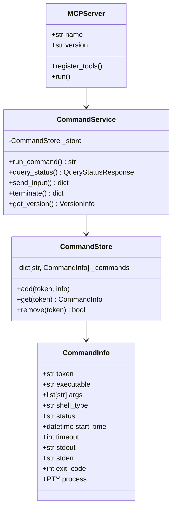

# winterm-mcp Python 版本规格说明书

**更新日期**: 2026-01-29  
**版本**: 1.0.0  
**目标**: 将 Node.js 版本的 winterm-mcp 完整移植到 Python

---

## 1. 项目概述

### 1.1 项目目标
将现有的 Node.js 版本 winterm-mcp 完整移植到 Python，实现一个基于 MCP (Model Context Protocol) 协议的 Windows 终端命令执行服务。

### 1.2 核心功能
- 异步执行 Windows 终端命令（PowerShell、CMD、任意可执行文件）
- 基于 Token 的状态跟踪机制
- 支持交互式命令输入
- 支持命令终止
- 实时输出流式传输
- 自动清理 ANSI 转义序列

### 1.3 技术栈要求
- **Python**: >= 3.10
- **MCP SDK**: `mcp` (Python 官方 SDK)
- **PTY 实现**: `pywinpty` (Windows PTY 支持)
- **类型注解**: 完整 Type Hints 支持

---

## 2. 架构设计

### 2.1 模块结构
```
winterm_mcp/
├── __init__.py          # 包入口
├── __main__.py          # CLI 入口 (python -m winterm_mcp)
├── server.py            # MCP Server 实现
├── service.py           # 核心业务逻辑
├── models.py            # 数据模型定义
├── constants.py         # 常量定义
└── utils.py             # 工具函数
```

### 2.2 类图



---

## 3. 数据模型规范

### 3.1 CommandInfo (命令信息)
```python
@dataclass
class CommandInfo:
    token: str                          # UUID 令牌
    executable: str                     # 可执行文件路径
    args: list[str]                     # 参数列表
    command: str                        # 原始命令（兼容字段）
    shell_type: Literal["powershell", "cmd", "executable"]
    status: Literal["pending", "running", "completed", "not_found", "terminated"]
    start_time: datetime
    timeout: int                        # 毫秒
    working_directory: str | None
    stdout: str
    stderr: str
    exit_code: int | None
    execution_time: int | None          # 毫秒
    timeout_occurred: bool
    pty_process: Any | None             # pywinpty 进程对象
    enable_streaming: bool
    last_output_timestamp: int          # 时间戳（毫秒）
```

### 3.2 QueryStatusResponse (状态查询响应)
```python
@dataclass
class QueryStatusResponse:
    token: str
    status: str
    exit_code: int | None = None
    stdout: str | None = None
    stderr: str | None = None
    execution_time: int | None = None
    timeout_occurred: bool | None = None
    message: str | None = None
```

### 3.3 VersionInfo (版本信息)
```python
@dataclass
class VersionInfo:
    version: str
    service_status: str
    python_version: str
    platform: str
    arch: str
    env: dict[str, str | None]
```

### 3.4 RunCommandParams (执行命令参数)
```python
@dataclass
class RunCommandParams:
    command: str
    executable: str | None = None
    args: list[str] | None = None
    shell_type: Literal["powershell", "cmd", "executable"] = "executable"
    timeout: int = 30                   # 秒
    working_directory: str | None = None
    enable_streaming: bool = False
```

---

## 4. 工具接口规范

### 4.1 run_command
**描述**: 在终端中执行命令，返回 token 用于跟踪

**参数**:
| 字段 | 类型 | 必需 | 默认值 | 说明 |
|------|------|------|--------|------|
| command | str | 是 | - | 要执行的命令 |
| executable | str | 否 | None | 可执行文件路径 |
| args | list[str] | 否 | None | 可执行文件参数 |
| shell_type | str | 否 | "executable" | 执行类型: powershell/cmd/executable |
| timeout | int | 否 | 30 | 超时秒数 (1-3600) |
| working_directory | str | 否 | None | 工作目录 |
| enable_streaming | bool | 否 | False | 启用实时流式输出 |

**返回**:
```python
{
    "token": str,           # UUID 令牌
    "status": "pending",    # 状态
    "message": "submitted"  # 消息
}
```

**验证规则**:
- command 不能为空字符串，最大长度 1000
- timeout 必须在 1-3600 范围内
- shell_type 必须是 "powershell"、"cmd" 或 "executable"

### 4.2 query_command_status
**描述**: 使用 token 查询命令状态

**参数**:
| 字段 | 类型 | 必需 | 说明 |
|------|------|------|------|
| token | str | 是 | run_command 返回的令牌 |

**返回**:
```python
{
    "token": str,
    "status": str,          # pending/running/completed/not_found/terminated
    "exit_code": int | None,
    "stdout": str,
    "stderr": str,
    "execution_time": int | None,  # 毫秒
    "timeout_occurred": bool | None,
    "message": str | None
}
```

### 4.3 enhanced_query_command_status
**描述**: 增强版状态查询，支持流式输出

**参数**:
| 字段 | 类型 | 必需 | 说明 |
|------|------|------|------|
| token | str | 是 | 命令令牌 |
| since_timestamp | int | 否 | 只返回此时间戳之后的输出 |

**返回**: 同 query_command_status

### 4.4 send_command_input
**描述**: 向正在运行的命令发送输入

**参数**:
| 字段 | 类型 | 必需 | 默认值 | 说明 |
|------|------|------|--------|------|
| token | str | 是 | - | 命令令牌 |
| input | str | 是 | - | 要发送的输入 |
| append_newline | bool | 否 | True | 是否追加换行符 |

**返回**:
```python
{
    "success": bool,
    "message": str | None,
    "token": str
}
```

### 4.5 terminate_command
**描述**: 终止正在运行的命令

**参数**:
| 字段 | 类型 | 必需 | 说明 |
|------|------|------|------|
| token | str | 是 | 命令令牌 |

**返回**:
```python
{
    "success": bool,
    "message": str | None,
    "token": str
}
```

### 4.6 get_version
**描述**: 获取版本信息

**参数**: 无

**返回**:
```python
{
    "version": str,
    "service_status": str,
    "python_version": str,
    "platform": str,
    "arch": str,
    "env": {
        "WINTERM_POWERSHELL_PATH": str | None,
        "WINTERM_CMD_PATH": str | None,
        "WINTERM_LOG_LEVEL": str | None
    }
}
```

---

## 5. 核心功能实现规范

### 5.1 命令存储 (CommandStore)
```python
class CommandStore:
    """命令存储管理类，线程安全"""
    
    def __init__(self) -> None:
        self._commands: dict[str, CommandInfo] = {}
        self._lock = threading.Lock()
    
    def add_command(self, token: str, info: CommandInfo) -> None: ...
    def get_command(self, token: str) -> CommandInfo | None: ...
    def remove_command(self, token: str) -> bool: ...
    def get_all_tokens(self) -> list[str]: ...
```

### 5.2 Shell 查找
```python
def find_powershell() -> str:
    """
    查找 PowerShell 可执行文件路径
    优先级:
    1. WINTERM_POWERSHELL_PATH 环境变量
    2. 标准 PowerShell 路径
    3. PowerShell Core 路径
    4. PATH 环境变量
    5. 抛出 FileNotFoundError
    """
    ...

def find_cmd() -> str:
    """
    查找 CMD 可执行文件路径
    优先级:
    1. WINTERM_CMD_PATH 环境变量
    2. 标准 CMD 路径
    3. PATH 环境变量
    4. 抛出 FileNotFoundError
    """
    ...
```

### 5.3 可执行文件路径解析
```python
def resolve_executable_path(executable: str) -> str:
    """
    解析可执行文件路径
    - 如果是绝对路径，直接返回
    - 检查当前目录
    - 在 PATH 中搜索（支持 .exe, .bat, .cmd, .com, .ps1）
    - 返回原始名称（让系统处理错误）
    """
    ...
```

### 5.4 ANSI 转义序列清理
```python
def strip_ansi_codes(text: str) -> str:
    """
    移除 ANSI 转义序列
    - CSI 序列: \x1b[... 或 \u001b[...
    - OSC 序列: \x1b]...\x07
    - BEL 字符: \x07
    """
    ...
```

### 5.5 命令执行 (核心)
```python
def run_command(
    command: str,
    executable: str | None = None,
    args: list[str] | None = None,
    shell_type: Literal["powershell", "cmd", "executable"] = "executable",
    timeout: int = 30,
    working_directory: str | None = None,
    enable_streaming: bool = False
) -> str:
    """
    异步执行命令，返回 token
    
    执行流程:
    1. 解析可执行文件和参数
    2. 生成 UUID token
    3. 创建 CommandInfo 并存储
    4. 在后台线程启动 PTY 进程
    5. 返回 token
    
    PTY 配置:
    - cols: 80
    - rows: 30
    - cwd: working_directory or os.getcwd()
    - env: os.environ
    """
    ...

def _execute_with_pty(
    token: str,
    executable: str,
    args: list[str],
    shell_type: str,
    timeout_ms: int,
    working_directory: str | None
) -> None:
    """
    内部函数：在 PTY 中执行命令
    
    处理逻辑:
    1. 使用 pywinpty 创建 PTY 进程
    2. 注册 on_data 回调捕获输出
    3. 注册 on_exit 回调处理完成
    4. 设置超时定时器
    5. 处理执行错误（ENOENT, EACCES, EPERM）
    """
    ...
```

### 5.6 交互功能
```python
def send_command_input(
    token: str,
    input: str,
    append_newline: bool = True
) -> dict[str, Any]:
    """
    向运行中的命令发送输入
    
    验证:
    - token 必须存在
    - 命令状态必须是 running
    - pty_process 必须存在
    
    操作:
    - 如果 append_newline 为 True，追加 \r\n
    - 调用 pty_process.write()
    """
    ...

def terminate_command(token: str) -> dict[str, Any]:
    """
    终止运行中的命令
    
    验证:
    - token 必须存在
    - 命令状态必须是 running
    - pty_process 必须存在
    
    操作:
    - 调用 pty_process.terminate() 或 kill()
    - 更新状态为 terminated
    - exit_code 设为 -1
    """
    ...
```

---

## 6. MCP Server 实现

### 6.1 Server 配置
```python
from mcp.server import Server
from mcp.server.stdio import stdio_server

# Server 元数据
NAME = "winterm-mcp"
VERSION = "0.1.6"
```

### 6.2 工具注册
使用 `@server.tool()` 装饰器注册所有工具：
- `run_command`
- `query_command_status`
- `enhanced_query_command_status`
- `send_command_input`
- `terminate_command`
- `get_version`

### 6.3 主入口
```python
async def main() -> None:
    server = Server(NAME)
    
    # 注册工具
    register_tools(server)
    
    # 启动 stdio 传输
    async with stdio_server() as (read_stream, write_stream):
        await server.run(
            read_stream,
            write_stream,
            InitializationOptions(
                server_name=NAME,
                server_version=VERSION,
                capabilities=server.get_capabilities()
            )
        )

if __name__ == "__main__":
    asyncio.run(main())
```

---

## 7. 环境变量

| 变量名 | 说明 | 优先级 |
|--------|------|--------|
| WINTERM_POWERSHELL_PATH | 自定义 PowerShell 路径 | 高 |
| WINTERM_CMD_PATH | 自定义 CMD 路径 | 高 |
| WINTERM_LOG_LEVEL | 日志级别 (debug/info/warning/error) | - |

---

## 8. 错误处理规范

### 8.1 错误类型
```python
class WintermMCPError(Exception):
    """基础错误类"""
    pass

class ExecutableNotFoundError(WintermMCPError):
    """可执行文件未找到"""
    pass

class CommandNotFoundError(WintermMCPError):
    """命令 token 不存在"""
    pass

class CommandNotRunningError(WintermMCPError):
    """命令未在运行状态"""
    pass
```

### 8.2 错误响应格式
```python
{
    "success": False,
    "message": "详细的错误描述",
    "token": str  # 如果适用
}
```

---

## 9. 项目配置

### 9.1 pyproject.toml
```toml
[project]
name = "winterm-mcp"
version = "0.1.6"
description = "Python implementation of terminal MCP similar to winterm with PTY interaction support"
requires-python = ">=3.10"
dependencies = [
    "mcp>=1.0.0",
    "pywinpty>=2.0.0",
]

[project.scripts]
winterm-mcp = "winterm_mcp:main"
```

### 9.2 目录结构
```
winterm-mcp-python/
├── pyproject.toml
├── README.md
├── src/
│   └── winterm_mcp/
│       ├── __init__.py
│       ├── __main__.py
│       ├── server.py
│       ├── service.py
│       ├── models.py
│       ├── constants.py
│       └── utils.py
└── tests/
    ├── __init__.py
    ├── test_service.py
    └── test_server.py
```

---

## 10. 测试要求

### 10.1 单元测试
- CommandStore 的增删改查
- Shell 路径查找
- 可执行文件路径解析
- ANSI 转义序列清理
- 参数验证

### 10.2 集成测试
- 完整命令执行流程
- 交互式命令输入
- 命令终止
- 超时处理

---

## 11. 实现检查清单

- [ ] 项目结构和配置文件
- [ ] 数据模型 (models.py)
- [ ] 常量定义 (constants.py)
- [ ] 工具函数 (utils.py)
- [ ] 命令存储 (CommandStore)
- [ ] Shell 查找函数
- [ ] 可执行文件路径解析
- [ ] run_command 实现
- [ ] PTY 执行逻辑
- [ ] query_command_status 实现
- [ ] enhanced_query_command_status 实现
- [ ] send_command_input 实现
- [ ] terminate_command 实现
- [ ] get_version 实现
- [ ] MCP Server 和工具注册
- [ ] CLI 入口
- [ ] 单元测试
- [ ] 集成测试
- [ ] README 文档

---

## 12. 参考实现

Node.js 参考实现位置: `d:\Dev2026\05.Node-mcp\NodeMcps\src\winterm-mcp\`

关键文件:
- `src/service.ts` - 核心业务逻辑
- `src/index.ts` - MCP Server 和工具注册
- `src/models.ts` (隐含在 service.ts 中) - 数据模型
