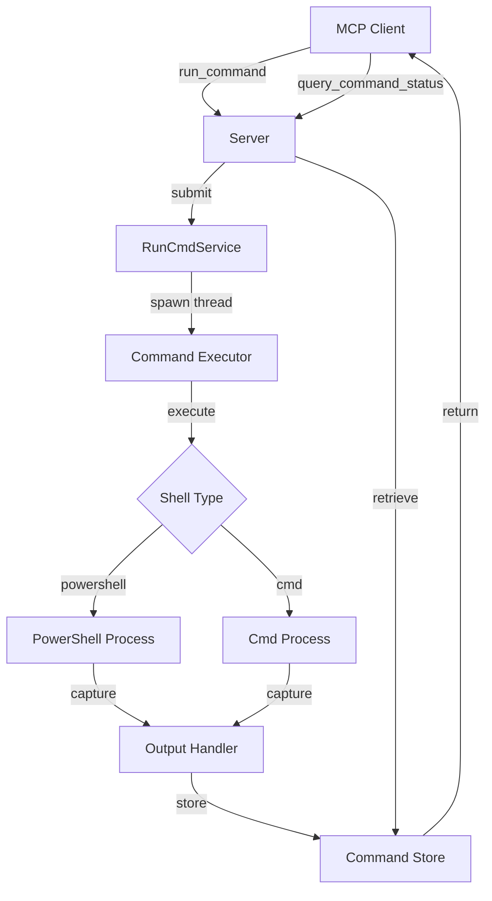
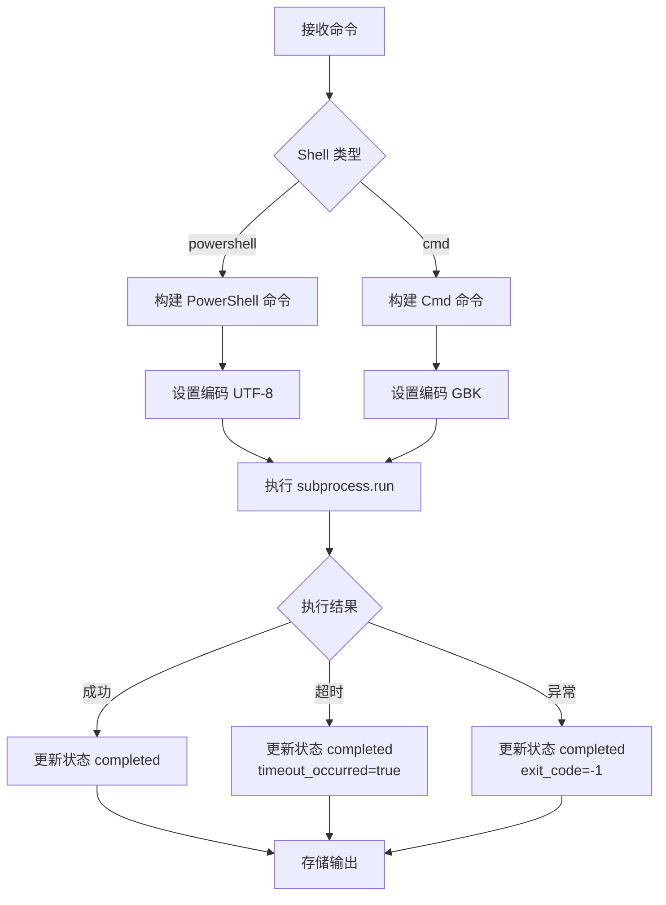

# winterm-mcp 技术设计文档

**更新日期**: 2026-01-16  
**版本**: 1.0.0  
**作者**: winterm-mcp contributors

---

## 1. 项目概述

### 1.1 项目背景

runcmd-mcp 在 Windows 平台上存在以下问题：
- 仅支持 cmd 命令，无法直接执行 PowerShell 命令
- 使用 `subprocess.run(shell=True)` 时，Windows 默认使用 `cmd.exe`
- 输出编码处理不完善，中文输出可能乱码

### 1.2 项目目标

创建一个专门支持 Windows 终端的 MCP 工具，提供：
- 完整的 PowerShell 支持（默认）
- Cmd 命令兼容
- 自动编码处理（PowerShell: UTF-8, Cmd: GBK）
- 异步执行和状态查询

### 1.3 核心功能

| 功能 | 描述 |
|------|------|
| PowerShell 执行 | 直接执行 PowerShell 命令，无需前缀 |
| Cmd 执行 | 可选执行 cmd 命令 |
| 异步执行 | 后台执行，立即返回 token |
| 状态查询 | 查询命令执行状态和结果 |
| 超时控制 | 可设置超时时间（1-3600秒） |
| 工作目录 | 指定执行目录 |
| 输出编码 | 自动处理不同 shell 的编码 |

---

## 2. 架构设计

### 2.1 系统架构



### 2.2 模块划分

| 模块 | 文件 | 职责 |
|------|------|------|
| Server | `server.py` | MCP 服务器入口，定义工具接口 |
| Service | `service.py` | 核心业务逻辑，管理命令执行和状态 |
| Main | `__main__.py` | 程序入口，初始化服务 |

### 2.3 目录结构

```
winterm_mcp_standalone/
├── src/
│   └── winterm_mcp/
│       ├── __init__.py
│       ├── __main__.py
│       ├── server.py
│       └── service.py
├── docs/
│   └── SDD.md
├── LICENSE
├── README.md
└── pyproject.toml
```

---

## 3. 详细设计

### 3.1 数据模型

#### 3.1.1 命令信息

```python
CommandInfo = {
    "token": str,              # 唯一标识符 (UUID)
    "command": str,            # 执行的命令
    "shell_type": str,         # shell 类型 (powershell/cmd)
    "status": str,             # 状态 (pending/running/completed)
    "start_time": datetime,    # 开始时间
    "timeout": int,            # 超时时间（秒）
    "working_directory": str,  # 工作目录
    "stdout": str,             # 标准输出
    "stderr": str,             # 标准错误
    "exit_code": int,          # 退出码
    "execution_time": float,   # 执行时间（秒）
    "timeout_occurred": bool,  # 是否超时
}
```

### 3.2 接口设计

#### 3.2.1 run_command

**功能**: 异步执行 Windows 终端命令

**参数**:
- `command` (str): 要执行的命令（必填，1-1000字符）
- `shell_type` (str, optional): Shell 类型，`powershell` 或 `cmd`，默认 `powershell`
- `timeout` (int, optional): 超时秒数（1-3600），默认 30
- `working_directory` (str, optional): 工作目录（可选，默认当前目录）

**返回**:
```python
{
    "token": str,      # 命令 token
    "status": str,     # "pending"
    "message": str     # "submitted"
}
```

#### 3.2.2 query_command_status

**功能**: 查询命令执行状态和结果

**参数**:
- `token` (str): 命令 token

**返回**:
```python
# 运行中
{
    "token": str,
    "status": "running"
}

# 已完成
{
    "token": str,
    "status": "completed",
    "exit_code": int,
    "stdout": str,
    "stderr": str,
    "execution_time": float,
    "timeout_occurred": bool
}

# 未找到
{
    "token": str,
    "status": "not_found",
    "message": "Token not found"
}
```

### 3.3 核心算法

#### 3.3.1 命令执行流程



#### 3.3.2 编码处理

| Shell 类型 | 编码 | 说明 |
|-----------|------|------|
| PowerShell | UTF-8 | PowerShell 默认使用 UTF-8 |
| Cmd | GBK | Windows cmd 默认使用 GBK（代码页 936） |

### 3.4 并发控制

- 使用 `threading.Lock` 保护共享数据（命令存储）
- 每个命令在独立线程中执行
- 线程设置为 daemon，避免阻塞程序退出

---

## 4. 技术选型

### 4.1 依赖库

| 库 | 版本 | 用途 |
|----|------|------|
| fastmcp | >=0.1.0 | MCP 服务器框架 |
| pydantic | >=2.0.0 | 数据验证 |

### 4.2 Python 版本

- Python 3.8+
- 支持 Windows 平台

---

## 5. 实施计划

### 5.1 开发阶段

| 阶段 | 任务 | 产出 |
|------|------|------|
| 1 | 创建项目结构 | 目录、配置文件 |
| 2 | 实现 Service 层 | `service.py` |
| 3 | 实现 Server 层 | `server.py` |
| 4 | 实现入口 | `__main__.py` |
| 5 | 编写文档 | `README.md` |
| 6 | 测试验证 | 功能测试 |

### 5.2 测试计划

| 测试项 | 测试内容 |
|--------|---------|
| PowerShell 执行 | `Get-Date`, `Get-Process` |
| Cmd 执行 | `dir`, `ping` |
| 超时处理 | 长时间命令超时 |
| 状态查询 | pending/running/completed 状态流转 |
| 编码处理 | 中文输出正确性 |
| 工作目录 | 指定目录执行 |
| 错误处理 | 无效命令、无效 token |

---

## 6. 风险与对策

| 风险 | 影响 | 对策 |
|------|------|------|
| 编码问题 | 中文输出乱码 | 自动检测并设置正确编码 |
| 超时处理 | 命令无法终止 | 使用 subprocess.TimeoutExpired |
| 线程安全 | 数据竞争 | 使用 threading.Lock |
| 路径问题 | 工作目录无效 | 验证路径存在性 |

---

## 7. 附录

### 7.1 参考资料

- [MCP 协议规范](https://modelcontextprotocol.io/)
- [FastMCP 文档](https://github.com/jlowin/fastmcp)
- [Python subprocess 文档](https://docs.python.org/3/library/subprocess.html)

### 7.2 版本历史

| 版本 | 日期 | 变更 |
|------|------|------|
| 1.0.0 | 2026-01-16 | 初始版本 |
